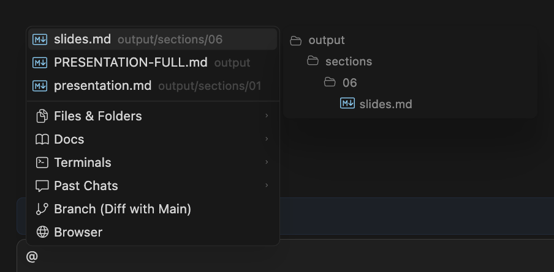

# Cursor Agentic Coding in Practice

## Section 01 — Einstieg: Der Agent

**Fragestellungen:** Kontext im Chat? Tools? Wo läuft es? Wie steuert ihr nach?

[Vollständige Agenda](../../../Workshop.md)

---

# Agent-Arbeit ist kein „normaler Chat“

- [Overview](https://cursor.com/docs/agent/overview): **Instructions**, **Tools**, **Modell**
- Ihr steuert **Nachrichten** + **Kontext** (`@`) und **Queue** (Enter / Cmd+Enter)

**Roter Faden:** erst **Chat-Kontext**, dann **Tools**, dann **Laufumgebung & UI**

---

# Kontext im Chat: `@`

- **Datei** · **Ordner** · **Code-Symbol**
- **`@Docs`** — auch **eigene** Dokumentation (*Add new doc*)
- **`@Past Chats`**
- **Diff / Branch zu `main`:** im **Prompt** beschreiben (Cursor 2.0: kein `@Git` im Menü)
- **Terminal:** Agent nutzt **Shell**-Tool; Dateien mit `@` anpinnen

[Prompting agents](https://cursor.com/docs/agent/prompting)

---

# Tools (was der Agent ausführt)

| | |
| --- | --- |
| **Semantic Search** | Codebase nach Bedeutung |
| **Shell / Web / Edit** | Terminal, Recherche, Dateien |
| **Browser-Tool** | Seite **steuern**, Screenshots ([Doku](https://cursor.com/docs/agent/tools/browser)) |
| **Bildgenerierung** | z. B. Mockups → oft `assets/` |

**Abgrenzung:** **`@`** = Kontext **in den Prompt** · **Browser-Tool** = echte **UI-Session**

[Overview → Tools](https://cursor.com/docs/agent/overview#tools)

---

# Wo arbeitet der Agent?

| Laufumgebung | Kurz |
| --- | --- |
| **Local** | Euer Workspace |
| **Worktree** | Isolierte lokale Sandbox |
| **Cloud** | Separater Lauf / Branch |

→ **Risiko** & **Zusammenarbeit**

---

# UI: drei Anker

1. **Context Window** — woher kommt der Kontext?
2. **Modellauswahl**
3. **Laufumgebung** (Local / Worktree / Cloud)

**Medien:**

- [Context `@`](../../../input/sections/01/Context.png)
- [Context Window](../../../input/ui-controls/context-window.png)
- [Model Selection](../../../input/ui-controls/model-selection.png)
- [Worktree](../../../input/ui-controls/work-tree.png)

---

# Nachsteuern während der Arbeit

| Aktion | Wirkung |
| --- | --- |
| **Enter** | **Queue** — nach aktuellem Schritt |
| **Cmd+Enter** / **Ctrl+Enter** | **Sofort** — Eingriff |

> Queue lässt fertigarbeiten — Immediate korrigiert den Lauf.

---

# Bilder im Prompt

- **Paste** (`Cmd+V`) oder **Drag & Drop** — Screenshots, Fehler, Mockups
- Zusätzlich: Agent kann **Bilder generieren** (Tool)

---

# Nächster Teil

**Section 02:** **Ask**, **Plan**, **Agent**, **Debug** — wann welcher Modus?

---

# Weiterführend

- [Agent Overview](https://cursor.com/docs/agent/overview)
- [Prompting agents](https://cursor.com/docs/agent/prompting)
- [Documentation Overview](https://cursor.com/docs)
